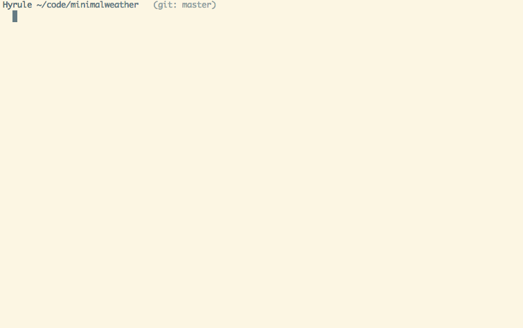

# gpm-bootstrap [](https://travis-ci.org/pote/gpm-bootstrap)

gpm-bootstrap is a plugin for [gpm](https://github.com/pote/gpm), the Go Package Manager. It provides a simple way to get started with dependency versioning tracking on your Go projects by creating a `Godeps` file with all your dependencies set to their latest versions.

Requires [gpm v1.1.1](https://github.com/pote/gpm/releases/tag/v1.1.1) which introduces gpm plugins.

## Installation

### Via Homebrew

```bash
$ brew tap pote/gpm_plugins
$ brew install gpm-bootstrap
```

### Manual on *nix
```bash
$ git clone git@github.com:pote/gpm-bootstrap.git && cd gpm-bootstrap
$ ./configure
$ make install
```

## Example Usage



## Usage

Once installed, gpm-bootstrap adds the following commands to gpm:

```bash
$ gpm bootstrap           # Downloads all external top-level packages required by
                          # your application and generates a Godeps file with their
                          # latest tags or revisions.
$ gpm bootstrap version   # Prints version information for the plugin.
$ gpm bootstrap help      # Prints this message.
```
